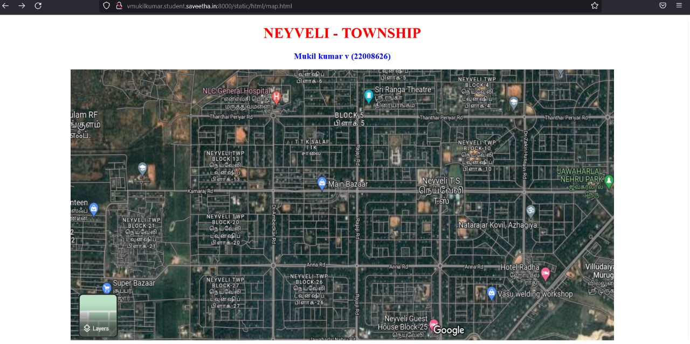

# Places Around Me
## AIM:
To develop a website to display details about the places around my house.

## Design Steps:

## Step 1:
Clone the git repository into Theia IDE.

## Step 2:
Create a new Django project.

## Step 3:
Write the needed HTML code.

## Step 4:
Run the Django server and execute the HTML files.
## Code:
```python
 map.html

 <!DOCTYPE html>
<html lang="en">
<head>
<title>My City</title>
</head>
<body>
<h1 align="center">
<font color="red"><b>NEYVELI - TOWNSHIP</b></font>
</h1>
<h3 align="center">
<font color="blue"><b>Mukil kumar v (22008626)</b></font>
</h3>
<center>

<map name="MyCity">
<area shape="circle" coords="1150,265,50" href="/static/html/1.html" title="Jawaharlal Nehru Park">
<area shape="circle" coords="550,280,65" href="/static/html/2.html" title="Main Bazaar">
<area shape="circle" coords="405,50,53" href="/static/html/3.html" title="general hospital">
<area shape="circle" coords="1000,360,50" href="/static/html/4.html" title="Natarajar Kovil">
<area shape="circle" coords="690,50,50" href="/static/html/5.html" title="Sri ranga theatre">
</map>
</center>
</body>
</html>

1.html

<!DOCTYPE html>
<html lang="en">
<head>
<title>Jawaharlal Nehru Park</title>
</head>
<body bgcolor="pink">
<h1 align="center">
<font color="red"><b>Neyveli - Township</b></font>
</h1>
<h3 align="center">
<font color="blue"><b>Jawaharlal Nehru Park></font>
</h3>
<hr size="3" color="red">
<p align="justify">
<font face="Arial" size="5">
<b>
Nehru Park is one of the popular parks in Neyveli. The park is beautifully maintained and is said to be the best eco-friendly park in the country. Moreover, this Nehru Park has been ranked in the international level. You can easily locate the park inside the city due to its popularity. Nehru Park is located at Neyveli Township in Block 8., https://indiapl.com/tamil-nadu/jawaharlal-nehru-park-358558
</b>
</font>
</p>
</body>
</html>

2.html

<!DOCTYPE html>
<html lang="en">
<head>
<title>MAIN BAZAAR</title>
</head>
<body bgcolor="cyan">
<h1 align="center">
<font color="red"><b>Neyveli township</b></font>
</h1>
<h3 align="center">
<font color="blue"><b>Main bazaar</b></font>
</h3>
<hr size="3" color="red">
<p align="justify">
<font face="Courier New" size="5">
<b>
The Bazaar where everything is available in neyveli township 24/7. From snacks to all necessary accessories are there at cheap price.
</b/>
</font>
</p>
</body>
</html>

3.html

<!DOCTYPE html>
<html lang="en">

<head>
    <title>General Hospial</title>
</head>

<body bgcolor="yellow">
    <h1 align="center">
        <font color="red"><b>Neyveli - Township</b></font>
    </h1>
    <h3 align="center">
        <font color="blue"><b>general hospital</b></font>
    </h3>
    <hr size="3" color="red">
    <p align="justify">
        <font face="Tahoma" size="5">
            <b>
                Healthcare Services in Neyveli Said to be the well-planned and modern township, Neyveli is managed by the Neyveli Lignite Corporations Department of Township Administration. The administration runs several hospitals and health care centers. NLC handles a well equipped hospital with 369 beds along with five dispensaries to meet the medical requirements of the employees and their dependents and the public
            </b>
        </font>
    </p>
</body>

</html>

4.html

<html lang="en">
<head>
<title>Natarajar Kovil</title>
</head>
<body bgcolor="cyan">
<h1 align="center">
<font color="red"><b>Neyveli township</b></font>
</h1>
<h3 align="center">
<font color="blue"><b>Nataraj Kovil</b></font>
</h3>
<hr size="3" color="red">
<p align="justify">
<font face="Courier New" size="5">
<b>
Natarajar Kovil is one of the famous temple in neyveli township.Neyveli is a cosmopolitan city with people from all religions living in that small township. There are temples for Lord Krishna, Lord, Ayappa, Lord Murugan, Lord Nataraja  in Neyveli. Of these, the Nataraja temple is well known for the metal statue of Lord Shiva as Nataraja, which is the biggest statue in the world. The temple is believed to find its place in the Guinness Book of Records as its height is 10 feet 1 inch with a base of 8 feet 4 inch and a weight of 2,420 kilograms. There is an idol of Godess Sivakami measuring 7 feet in height and 750 kilograms in weight
</b>
</font>
</p>
</body>
</html>

5.html

<!DOCTYPE html>
<html lang="en">
<head>
<title>Sri ranga theatre</title>
</head>
<body bgcolor="orange">
<h1 align="center">
<font color="red"><b>Neyveli - township</b></font>
</h1>
<h3 align="center">
<font color="blue"><b>Sri ranga theatre</b></font>
</h3>
<hr size="3" color="red">
<p align="justify">
<font face="Georgia" size="5">
Sri ranga theatre is the best theatre around neyveli.This theatre can make its customer feel the best expirience in watching movies.This theatre maintain its enviroinment in a very neat manner.They provide best quality snacks and in very cheap price.There are five screens in this theatre.Three screens for tamil language movies and two screens for other language movies. in overall this is one place to enjoy the weekend in neyveli.
</font>
</p>
</body>
</html>
```

## Output:



## Result:
Write your result